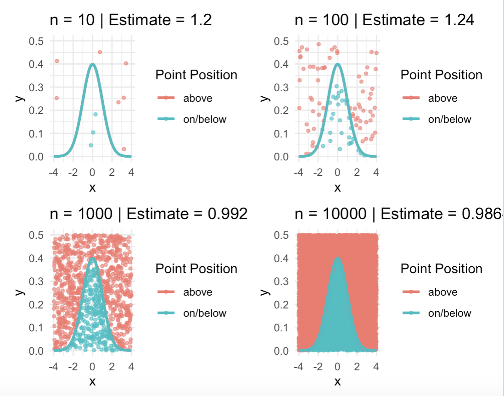

# Introduction

This document presents a reproducible data analysis using Quarto. The goal of this assignment is to combine data wrangling, visualization, and written interpretation into a single, organized report.\
\
The analysis includes two main components. First, passenger traffic data from six major airports is examined using both a table and a line graph to identify trends over time. Second, a Monte Carlo simulation is used to estimate the area under a curve and demonstrate how increasing sample size improves accuracy.\
\
In addition, this document explores the use of generative AI tools for data analysis by developing a plan, prompting an AI model, and comparing the results to a generic prompt. Finally, a reflection summarizes key takeaways from the assignment.

```{r}
library(rvest)
library(xml2)
library(dplyr)
library(tidyr)
library(ggplot2)

url <- "https://en.wikipedia.org/wiki/List_of_busiest_airports_by_passenger_traffic"
page <- read_html(url)

nodes <- html_elements(page, xpath = "//h2 | //table[contains(@class, 'wikitable')]")

simple_names <- function(x) {
  x <- tolower(x)
  x <- gsub("[^a-z0-9]+", "_", x)
  x <- gsub("^_|_$", "", x)
  x
}

years_found <- c()
year_tables <- list()
current_year <- NA

for (i in seq_along(nodes)) {
  node <- nodes[[i]]
  node_name <- xml_name(node)

  if (node_name == "h2") {
    heading_text <- html_text(node, trim = TRUE)

    if (grepl("^202[0-5] statistics$", heading_text)) {
      current_year <- as.integer(sub(" .*", "", heading_text))
    }

  } else if (node_name == "table" && !is.na(current_year)) {
    tbl <- html_table(node)
    names(tbl) <- simple_names(names(tbl))

    airport_col <- names(tbl)[grepl("airport", names(tbl))][1]
    passenger_col <- names(tbl)[grepl("pass", names(tbl))][1]

    if (!is.na(airport_col) && !is.na(passenger_col)) {
      tbl2 <- data.frame(
        year = current_year,
        airport = trimws(tbl[[airport_col]]),
        passengers = as.numeric(gsub("[^0-9.]", "", tbl[[passenger_col]])),
        stringsAsFactors = FALSE
      )

      year_tables[[length(year_tables) + 1]] <- tbl2
      years_found <- c(years_found, current_year)
      current_year <- NA
    }
  }
}

busiest_airports_tidy <- do.call(rbind, year_tables)

airports_keep <- data.frame(
  airport = c(
    "Hartsfield-Jackson Atlanta International Airport",
    "Frankfurt Airport",
    "Beijing Daxing International Airport",
    "Dubai International Airport",
    "Tokyo Haneda Airport",
    "Heathrow Airport"
  ),
  iata = c("ATL", "FRA", "PKX", "DXB", "HND", "LHR"),
  stringsAsFactors = FALSE
)

busiest_airports_tidy <- merge(busiest_airports_tidy, airports_keep, by = "airport")
busiest_airports_tidy <- busiest_airports_tidy[, c("year", "airport", "iata", "passengers")]
busiest_airports_tidy <- busiest_airports_tidy[order(busiest_airports_tidy$airport, busiest_airports_tidy$year), ]

busiest_airports_table <- busiest_airports_tidy %>%
  select(airport, year, passengers) %>%
  pivot_wider(
    names_from = year,
    values_from = passengers
  ) %>%
  arrange(airport)
```

# Busiest Airports Analysis

This section analyzes passenger traffic across six major airports from 2020 to 2025. Both a table and a line graph are used to compare values and identify trends over time.

## Table

```{r}
busiest_airports_table
```

Looking at both the table and the line graph together gives a clearer picture of how passenger traffic changed across the six airports from 2020 to 2025. The table is helpful for comparing exact passenger values, while the graph makes it much easier to see overall trends and how quickly traffic changes over time. One major pattern is that passenger traffic remains relatively low in the earlier years and then increases sharply after 2023, showing a strong recovery in air travel.\
\
From the graph, Beijing Daxing (PKX) stands out the most, with a dramatic increase by 2025 that is much larger than any other airport. Other airports such as Atlanta (ATL), Dubai (DXB), and Frankfurt (FRA) also show growth, but their increases are more gradual and remain far below PKX. The table supports this observation by showing the exact passenger counts, confirming that PKX has the highest value by a significant margin in the final year.\
\
Overall, the graph is especially useful for comparing trends and rates of change, while the table allows for precise comparisons across specific years. Together, they show that although all airports experienced recovery, the scale and speed of that recovery vary greatly, with PKX showing the most extreme growth.

## Plot

```{r}
ggplot(busiest_airports_tidy, aes(x = year, y = passengers, color = iata, group = iata)) +
  geom_line(linewidth = 1) +
  geom_point(size = 2) +
  scale_x_continuous(breaks = 2020:2025) +
  labs(
    title = "Passenger Traffic for Six Busy Airports, 2020-2025",
    x = "Year",
    y = "Passengers",
    color = "Airport"
  ) +
  theme_minimal()
```

**Alt Text:** A line graph showing passenger traffic for six major airports from 2020 to 2025, with each airport represented by a different colored line. The plot shows a large increase in passenger traffic after 2023, with Beijing Daxing (PKX) showing the biggest rise.\
\
**Long Description:** This line graph shows passenger traffic for six major airports (ATL, FRA, PKX, DXB, HND, and LHR) from 2020 to 2025. Each line represents a different airport, allowing for comparison over time. Passenger traffic is very low from 2020 to 2023, then increases sharply starting in 2024. Beijing Daxing (PKX) shows the largest increase by 2025, while the other airports also show growth but at lower levels. Overall, the graph highlights a strong recovery in passenger traffic after earlier low values.

# Monte Carlo Numerical Integration

This section demonstrates how Monte Carlo simulation can be used to estimate the area under a curve. By randomly generating points and checking whether they fall under the curve, we can approximate the value of an integral.

## Small Multiple Visualization

```{r}

```

**Alt Text:** A four panel plot showing Monte Carlo simulations of a normal distribution at different sample sizes (n = 10, 100, 1000, and 10000). Each panel shows random points colored by whether they fall above or on/below the curve, with estimates becoming more accurate as the number of points increases.\
\
**Long Description:** This figure shows four Monte Carlo simulation plots estimating the area under the standard normal curve using different sample sizes (n = 10, 100, 1000, and 10000). Each plot includes randomly generated points within a rectangular region, colored based on whether they fall above or on/below the curve. As the sample size increases, the points fill the space more evenly, and the estimated integral values become more consistent. Smaller samples show more variability, while larger samples produce estimates that are closer to the true value.

**Narrative:** This small multiple demonstrates how increasing the number of random points improves the accuracy of the Monte Carlo estimate for the area under the standard normal curve. At smaller sample sizes, such as n = 10 and n = 100, the estimates vary quite a bit because the points are sparse and unevenly distributed, making the approximation less reliable.

As the sample size increases to n = 1000 and n = 10000, the points fill the region much more evenly, and the estimates become more stable. The change between the largest sample sizes is very small, which suggests that the estimate is converging to a consistent value.

Based on the larger sample sizes, the estimated value is very close to 1. This makes sense because the total area under the standard normal probability density function is exactly 1. The plots support this conclusion because the proportion of points under the curve stabilizes as the number of points increases.

Overall, this visualization shows that larger sample sizes lead to more accurate and reliable estimates.

# Planning and Prompting GenAI Tools

## Plan

Before using a generative AI tool, I created a plan for how to tidy and analyze the calcium dataset. The dataset is not tidy because measurements for different years and treatment groups are stored in separate columns.\
\
My plan included:\
1. Reshape the dataset from wide format to long format so that each row represents one observation.\
2. Create a variable for "treatment group" (null vs. diet/exercise).\
3. Create a variable for "year" (Initial, Year 1, Year 2, Year 3).\
4. Ensure calcium measurements are numeric and clean.\
5. Combine both groups into a single tidy dataset.\
6. Create a visualization (line plot) showing calcium levels over time.\
7. Use color to distinguish treatment groups.\
8. Interpret trends to compare how calcium levels change over time between the two groups.

## Plan Based Prompt

I have uploaded a dataset called calcium.csv. The data come from a longitudinal study of 31 women over four years. The first four columns represent the null treatment group (Initial, Year 1, Year 2, Year 3), and the next four columns represent the diet/exercise group with the same time points.

The data are not tidy. Please:

1. Convert the dataset into tidy (long) format
2. Create a variable for treatment group (null vs diet/exercise)
3. Create a variable for year (Initial, Year 1, Year 2, Year 3)
4. Ensure calcium values are numeric
5. Combine everything into one clean dataset
6. Create a line plot showing calcium levels over time
7. Use color to distinguish treatment groups

Please provide R code using tidyverse packages and explain what the code is doing.

## Response

The AI tool returned the following response:\
\
Below is a tidyverse-based solution to clean and visualize the calcium dataset.

```` r
r
library(tidyverse)

calcium <- read_csv("calcium.csv")

calcium_tidy <- calcium %>%
  mutate(id = row_number()) %>%
  pivot_longer(
    cols = -id,
    names_to = c("treatment", "year"),
    names_pattern = "(y[0-3])",
    values_to = "calcium"
  ) %>%
  mutate(
    treatment = if_else(row_number() %% 8 <= 4 & row_number() %% 8 != 0,
                        "Null",
                        "Diet/Exercise"),
    year = factor(
      year,
      levels = c("y0", "y1", "y2", "y3"),
      labels = c("Initial", "Year 1", "Year 2", "Year 3")
    ),
    calcium = as.numeric(calcium)
  ) %>%
  drop_na(calcium)

ggplot(calcium_tidy, aes(x = year, y = calcium, color = treatment, group = id)) +
  geom_line(alpha = 0.4) +
  stat_summary(
    aes(group = treatment),
    fun = mean,
    geom = "line",
    linewidth = 1.5
  ) +
  labs(
    title = "Calcium Levels Over Time by Treatment Group",
    x = "Year",
    y = "Calcium Level",
    color = "Treatment Group"
  ) +
  theme_minimal()
```
````

This code reshapes the dataset into a tidy format, creates variables for treatment and year, and produces a line plot showing calcium levels over time for both groups.

## Generic Prompt Result

Prompt: Create a data visualization for these data. Calcium.csv

I’ve created a clear data visualization based on your **calcium.csv** file.

📊 **Visualization Created: Boxplot of Calcium Measurements**

The figure below is a **box-and-whisker plot** showing the distribution of calcium values for each measurement series (y0, y1, y2, y3, repeated across groups).

**Why a boxplot?**

A boxplot is well suited for this dataset because it:

-   Shows **central tendency** (median)

-   Displays **spread and variability** (quartiles and range)

-   Highlights **outliers**

-   Allows easy **comparison across multiple groups**

**What you can see**

-   Differences in median calcium levels across measurement series

-   Variation within each series

-   Potential outliers or unusually low/high measurements

**The visualization**

```{r}
knitr::include_graphics("CopilotPlot.png")
```

If you’d like, I can also:

-   Create **line plots** (e.g., trends across rows)

-   Aggregate repeated variables (y0–y3) and visualize **means ± SD**

-   Produce **publication-ready figures** (journal style, grayscale, higher resolution)

-   Export the visualization to **PNG, PDF, or SVG**

Just tell me how you plan to use it (exploratory analysis, presentation, or publication).

Prompt: What is your current version information?

Here’s my current version information:

-   **Product**: **Microsoft 365 Copilot (M365 Copilot)**

-   **Underlying model**: **GPT5 chat model**

-   **Knowledge cutoff**: **2025**

-   **Current date/time (for this response)**: **March 31, 2026 (GMT04:00)**

Practically speaking, that means:

-   I can reason, analyze data, write code, and create visualizations.

-   I can also look up **uptodate information** when needed using web tools.

-   My builtin training knowledge goes up through 2025, with newer facts retrieved on demand.

If you’re asking because you need to cite the tool in a methods section or documentation, I can help you phrase that appropriately.

(This chat took place on Tuesday, March 31^st^, 2026.)

# Reflection

This assignment helped me better understand how to create a fully reproducible data analysis using Quarto. I learned how to organize code, visualizations, and explanations into a single document, which makes the analysis easier to follow and share.\
\
One key takeaway was the importance of using both tables and graphs. In the busiest airports section, the table allowed for precise comparisons of passenger counts, while the graph made it easier to identify trends and changes over time. This showed me how different types of visualizations can complement each other.\
\
The Monte Carlo section helped me understand how simulation methods can approximate values, such as the area under a curve. Seeing how the estimates improved as the number of points increased made it clear how sample size affects accuracy.\
\
I also learned that planning before using generative AI tools leads to better results. The plan based prompt produced a more structured and useful response compared to the generic prompt. Overall, this assignment improved both my technical skills and my ability to communicate data analysis effectively.

# Appendix A: GenAI Usage

## Tool Information

\- Tool used: Microsoft Copilot (Microsoft 365 Copilot)\
- Underlying model: GPT-5 chat model\
- Date used: March 31, 2026

## Prompts

### Plan Based Prompt

I have uploaded a dataset called calcium.csv. The data come from a longitudinal study of 31 women over four years. The first four columns represent the null treatment group (Initial, Year 1, Year 2, Year 3), and the next four columns represent the diet/exercise group with the same time points.

The data are not tidy. Please:

1. Convert the dataset into tidy (long) format
2. Create a variable for treatment group (null vs diet/exercise)
3. Create a variable for year (Initial, Year 1, Year 2, Year 3)
4. Ensure calcium values are numeric
5. Combine everything into one clean dataset
6. Create a line plot showing calcium levels over time
7. Use color to distinguish treatment groups

Please provide R code using tidyverse packages and explain what the code is doing.

## Responses

### Plan based Response

Below is a tidyverse-based solution to clean and visualize the calcium dataset.

```` r
r
library(tidyverse)

calcium <- read_csv("calcium.csv")

calcium_tidy <- calcium %>%
  mutate(id = row_number()) %>%
  pivot_longer(
    cols = -id,
    names_to = c("treatment", "year"),
    names_pattern = "(y[0-3])",
    values_to = "calcium"
  ) %>%
  mutate(
    treatment = if_else(row_number() %% 8 <= 4 & row_number() %% 8 != 0,
                        "Null",
                        "Diet/Exercise"),
    year = factor(
      year,
      levels = c("y0", "y1", "y2", "y3"),
      labels = c("Initial", "Year 1", "Year 2", "Year 3")
    ),
    calcium = as.numeric(calcium)
  ) %>%
  drop_na(calcium)

ggplot(calcium_tidy, aes(x = year, y = calcium, color = treatment, group = id)) +
  geom_line(alpha = 0.4) +
  stat_summary(
    aes(group = treatment),
    fun = mean,
    geom = "line",
    linewidth = 1.5
  ) +
  labs(
    title = "Calcium Levels Over Time by Treatment Group",
    x = "Year",
    y = "Calcium Level",
    color = "Treatment Group"
  ) +
  theme_minimal()
```
````

This code reshapes the dataset into a tidy format, creates variables for treatment and year, and produces a line plot showing calcium levels over time for both groups.

### Generic Response

Prompt: Create a data visualization for these data. Calcium.csv

I’ve created a clear data visualization based on your **calcium.csv** file.

📊 **Visualization Created: Boxplot of Calcium Measurements**

The figure below is a **box-and-whisker plot** showing the distribution of calcium values for each measurement series (y0, y1, y2, y3, repeated across groups).

**Why a boxplot?**

A boxplot is well suited for this dataset because it:

-   Shows **central tendency** (median)

-   Displays **spread and variability** (quartiles and range)

-   Highlights **outliers**

-   Allows easy **comparison across multiple groups**

**What you can see**

-   Differences in median calcium levels across measurement series

-   Variation within each series

-   Potential outliers or unusually low/high measurements

**The visualization**

```{r}
knitr::include_graphics("CopilotPlot.png")
```

If you’d like, I can also:

-   Create **line plots** (e.g., trends across rows)

-   Aggregate repeated variables (y0–y3) and visualize **means ± SD**

-   Produce **publication-ready figures** (journal style, grayscale, higher resolution)

-   Export the visualization to **PNG, PDF, or SVG**

Just tell me how you plan to use it (exploratory analysis, presentation, or publication).

Prompt: What is your current version information?

Here’s my current version information:

-   **Product**: **Microsoft 365 Copilot (M365 Copilot)**

-   **Underlying model**: **GPT5 chat model**

-   **Knowledge cutoff**: **2025**

-   **Current date/time (for this response)**: **March 31, 2026 (GMT04:00)**

Practically speaking, that means:

-   I can reason, analyze data, write code, and create visualizations.

-   I can also look up **uptodate information** when needed using web tools.

-   My builtin training knowledge goes up through 2025, with newer facts retrieved on demand.

If you’re asking because you need to cite the tool in a methods section or documentation, I can help you phrase that appropriately.

(This chat took place on Tuesday, March 31^st^, 2026.)

# Appendix B: Code Appendix

## Busiest Airports Code

```{r}
#| echo: true
#| eval: false

library(rvest)
library(xml2)
library(dplyr)
library(tidyr)
library(ggplot2)

url <- "https://en.wikipedia.org/wiki/List_of_busiest_airports_by_passenger_traffic"
page <- read_html(url)

nodes <- html_elements(page, xpath = "//h2 | //table[contains(@class, 'wikitable')]")

simple_names <- function(x) {
  x <- tolower(x)
  x <- gsub("[^a-z0-9]+", "_", x)
  x <- gsub("^_|_$", "", x)
  x
}

years_found <- c()
year_tables <- list()
current_year <- NA

for (i in seq_along(nodes)) {
  node <- nodes[[i]]
  node_name <- xml_name(node)

  if (node_name == "h2") {
    heading_text <- html_text(node, trim = TRUE)

    if (grepl("^202[0-5] statistics$", heading_text)) {
      current_year <- as.integer(sub(" .*", "", heading_text))
    }

  } else if (node_name == "table" && !is.na(current_year)) {
    tbl <- html_table(node)
    names(tbl) <- simple_names(names(tbl))

    airport_col <- names(tbl)[grepl("airport", names(tbl))][1]
    passenger_col <- names(tbl)[grepl("pass", names(tbl))][1]

    if (!is.na(airport_col) && !is.na(passenger_col)) {
      tbl2 <- data.frame(
        year = current_year,
        airport = trimws(tbl[[airport_col]]),
        passengers = as.numeric(gsub("[^0-9.]", "", tbl[[passenger_col]])),
        stringsAsFactors = FALSE
      )

      year_tables[[length(year_tables) + 1]] <- tbl2
      years_found <- c(years_found, current_year)
      current_year <- NA
    }
  }
}

busiest_airports_tidy <- do.call(rbind, year_tables)

airports_keep <- data.frame(
  airport = c(
    "Hartsfield-Jackson Atlanta International Airport",
    "Frankfurt Airport",
    "Beijing Daxing International Airport",
    "Dubai International Airport",
    "Tokyo Haneda Airport",
    "Heathrow Airport"
  ),
  iata = c("ATL", "FRA", "PKX", "DXB", "HND", "LHR"),
  stringsAsFactors = FALSE
)

busiest_airports_tidy <- merge(busiest_airports_tidy, airports_keep, by = "airport")
busiest_airports_tidy <- busiest_airports_tidy[, c("year", "airport", "iata", "passengers")]
busiest_airports_tidy <- busiest_airports_tidy[order(busiest_airports_tidy$airport, busiest_airports_tidy$year), ]

busiest_airports_table <- busiest_airports_tidy %>%
  select(airport, year, passengers) %>%
  pivot_wider(
    names_from = year,
    values_from = passengers
  ) %>%
  arrange(airport)

ggplot(busiest_airports_tidy, aes(x = year, y = passengers, color = iata, group = iata)) +
  geom_line(linewidth = 1) +
  geom_point(size = 2) +
  scale_x_continuous(breaks = 2020:2025) +
  labs(
    title = "Passenger Traffic for Six Busy Airports, 2020-2025",
    x = "Year",
    y = "Passengers",
    color = "Airport"
  ) +
  theme_minimal()
```

## Monte Carlo Code

```{r}
#| echo: true
#| eval: false

library(dplyr)
library(ggplot2)
library(patchwork)


monte_carlo_sim <- function(n, x_min, x_max, y_min, y_max) {
  x_vals <- runif(n, min = x_min, max = x_max)
  y_vals <- runif(n, min = y_min, max = y_max)

  data.frame(x = x_vals, y = y_vals)
}


make_mc_plot <- function(n) {
  sim_data <- monte_carlo_sim(n, -4, 4, 0, 0.5)

  mc_results <- sim_data %>%
    mutate(
      density = dnorm(x, mean = 0, sd = 1),
      position = ifelse(y <= density, "on/below", "above")
    )

  rectangle_area <- (4 - (-4)) * (0.5 - 0)
  prop_under_curve <- mean(mc_results$position == "on/below")
  estimated_integral <- prop_under_curve * rectangle_area

  ggplot(mc_results, aes(x = x, y = y, color = position)) +
    geom_point(alpha = 0.6, size = 1.2) +
    stat_function(
      fun = dnorm,
      args = list(mean = 0, sd = 1),
      xlim = c(-4, 4),
      linewidth = 1
    ) +
    labs(
      title = paste("n =", n, "\nEstimate =", round(estimated_integral, 4)),
      x = "x",
      y = "y",
      color = "Point Position"
    ) +
    coord_cartesian(xlim = c(-4, 4), ylim = c(0, 0.5)) +
    theme_minimal()
}

plot10 <- make_mc_plot(10)
plot100 <- make_mc_plot(100)
plot1000 <- make_mc_plot(1000)
plot10000 <- make_mc_plot(10000)

plot10 + plot100 + plot1000 + plot10000
```
